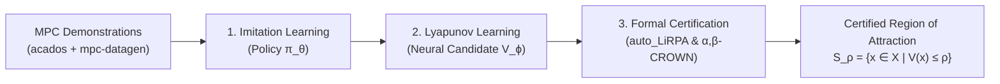

# Certification of Imitation Controllers using Learned Lyapunov Functions

[](https://www.python.org/downloads/)
[](LICENSE)
[](https://github.com/Verified-Intelligence/alpha-beta-CROWN)

Official repository for the Master's Thesis:
> **Certification of Imitation Controllers using Learned Lyapunov Functions**  
> *Josua Christoph Lindemann*  
> Technical University of Darmstadt | Control and Cyber-Physical Systems (CCPS), 2026  
> Advisors: Prof. Dr.-Ing. Rolf Findeisen, Hendrik Alsmeier M.Sc.

This framework provides an end-to-end pipeline for learning neural control policies from Model Predictive Control (MPC) demonstrations and establishing formal stability and forward-invariance guarantees via **Neural Lyapunov Functions** certified with **auto_LiRPA** and **$\alpha,\beta$-CROWN**.

---

## Table of Contents

- [Overview & Motivation](#overview--motivation)
- [The LCIL Pipeline](#the-lcil-pipeline)
  - [1. Expert Data Generation](#1-expert-data-generation-mpc)
  - [2. Imitation Learning](#2-imitation-learning-policy-training)
  - [3. Neural Lyapunov Learning](#3-neural-lyapunov-learning)
  - [4. Formal Certification](#4-formal-certification-verification)
- [Benchmark Systems](#benchmark-systems)
  - [Double Integrator](#1-double-integrator)
  - [Cartpole (Inverted Pendulum on Cart)](#2-cartpole-inverted-pendulum-on-cart)
- [Installation & Setup](#installation--setup)
- [Repository Structure](#repository-structure)
- [Citation & Acknowledgments](#citation--acknowledgments)

---

## Overview & Motivation

Nonlinear Model Predictive Control (NMPC) provides optimal constrained control, but solving constrained non-convex optimization problems online can be computationally prohibitive for fast or resource-constrained embedded systems. 

**Imitation learning** addresses this limitation by approximating the MPC feedback law with a neural network policy $\pi_\theta(x)$, reducing inference time to sub-millisecond scales. However, standard neural networks lack rigorous closed-loop guarantees regarding stability, forward invariance, and constraint satisfaction.

This framework bridges the gap:
1. **Imitates MPC behavior** using a constrained neural policy architecture that satisfies physical input limits and equilibrium conditions by construction.
2. **Co-trains a Neural Lyapunov Candidate** $V_\phi(x)$ alongside the policy using adversarial falsification to reshape the stability landscape.
3. **Formally certifies a Region of Attraction (ROA)** $\mathcal{S}_\rho = \{x \in \mathcal{X} \mid V(x) \le \rho\}$ using GPU-accelerated bound propagation and complete branch-and-bound verification ($\alpha,\beta$-CROWN).



---

## The LCIL Pipeline

### 1. Expert Data Generation (MPC)

Expert data is generated using discrete-time Optimal Control Problem (OCP) formulations solved by [acados](https://docs.acados.org/) via [mpc-datagen](https://github.com/ArgoJ/mpc-datagen):

$$\begin{aligned}
\min_{(x_{i|k}), (u_{i|k})} & \sum_{i=0}^{N-1} \ell(x_{i|k}, u_{i|k}) + V_f(x_{N|k}) \\
\text{s.t.} \quad & x_{i+1|k} = f(x_{i|k}, u_{i|k}), \quad x_{0|k} = x_k \\
& x_{i|k} \in \mathcal{X}, \quad u_{i|k} \in \mathcal{U}, \quad x_{N|k} \in \mathcal{X}_f
\end{aligned}$$

Closed-loop rollouts are evaluated, filtered for feasibility, and stored as standardized HDF5 datasets (`MPCDataset`).

### 2. Imitation Learning (Policy Training)

The policy $\pi_\theta(x)$ is trained using behavioral cloning on the collected MPC trajectories.

- **Architecture (`BoundedPolicy`)**:
  Enforces exact control input at the equilibrium $\pi_\theta(x^*) = u^*$ and guarantees actuator limits $\underline{u} \le \pi_\theta(x) \le \bar{u}$ by construction:
  $$\tilde{\pi}_\theta(x) = h_\theta(x) - h_\theta(x^*) + u^*$$
  $$\pi_\theta(x) = \text{clamp}\big(\tilde{\pi}_\theta(x), \; \underline{u}, \; \bar{u}\big)$$
- **Loss Formulation**:
  - `ScaledMSELoss`: Normalizes state and action dimensions according to operational ranges.
  - `StateWeightedMSELoss` / `ActionWeightedMSELoss`: Prioritizes approximation accuracy near the equilibrium with distance-based weighting $w_x(x)$.
  - `DynamicsAwareLoss`: Soft-penalizes predicted actions whose unconstrained forward step leaves the admissible state set $\mathcal{X}_\pi$:
    $$\mathcal{L}_f = \frac{1}{|B_\pi| n_x} \sum_{x \in B_\pi} \Big( \big\| [x^+ - \bar{x}_\pi]_+ \big\|_1 + \big\| [\underline{x}_\pi - x^+]_+ \big\|_1 \Big), \quad x^+ = f(x, \tilde{\pi}_\theta(x))$$

### 3. Neural Lyapunov Learning

A continuous function $V: \mathcal{X} \to \mathbb{R}_{\ge 0}$ is a valid discrete-time Lyapunov function for $x_{k+1} = f(x_k, \pi(x_k))$ if:
1. **Positive Definiteness**: $V(x^*) = 0$ and $V(x) > 0 \quad \forall x \in \mathcal{X} \setminus \{x^*\}$.
2. **Exponential Decrease**: $V(f(x, \pi(x))) - (1 - \kappa) V(x) \le 0 \quad \forall x \in \mathcal{S}_\rho$, with decay parameter $\kappa \in (0, 1]$.

#### Lyapunov Architecture (`NeuralLyapunovCandidate`)
To structurally guarantee positive definiteness without requiring verification of positivity:

$$V_\phi(x) = |g_\phi(x) - g_\phi(x^*)| + \|(\varepsilon I + R_\phi^T R_\phi)(x - x^*)\|_1$$

- $g_\phi(x): \mathbb{R}^{n_x} \to \mathbb{R}$ is an inner neural network.
- $R_\phi \in \mathbb{R}^{n_x \times n_x}$ is a learnable or fixed transformation matrix.
- **DARE Seeding**: $R_\phi$ is initialized from the discrete algebraic Riccati equation (DARE) solution $P = R_\phi^T R_\phi$ of the linearized dynamics around $x^*$, anchoring the local curvature to the optimal LQR cost-to-go.

#### Training Objective (`LyapunovTrainingLoss`)
- **$\rho$-Gated Condition Loss**: Penalizes decrease violations $V(x_{k+1}) - (1 - \kappa)V(x_k) > 0$ and state-invariance violations weighted by a soft gate $w_\rho(x)$.
- **ROA Loss**: Maximizes the sublevel volume by penalizing shell samples falling outside $\mathcal{S}_\rho$.
- **LiRPA Bound Loss (`ConditionLirpaLoss`)**: Leverages `auto_LiRPA` during training to bound and penalize worst-case decrease violations over hyper-rectangular state regions.
- **Falsification & Replay Buffer**: Employs PGD adversarial attacks to mine counterexamples and injects them into an aging replay buffer for targeted refinement.

### 4. Formal Certification (Verification)

Formal verification certifies the largest sublevel set $\mathcal{S}_\rho = \{x \in \mathcal{X} \mid V(x) \le \rho\}$ where:

$$\forall x \in \mathcal{S}_\rho: \quad (1 - \kappa) V(x) - V(f(x, \pi(x))) \ge 0 \quad \text{and} \quad f(x, \pi(x)) \in \mathcal{X}$$

- **`BisectCertifier`**: Employs a scaling and bisection search over $\rho$ with iteration limits $N_{\text{scale}}$ and $N_{\text{bisect}}$.
- **Punctured Domain Verification**: Explicitly excludes an $\epsilon$-neighborhood $X_{\text{hole}}$ around $x^*$ to avoid numerical issues at equilibrium.
- **Verification Engine**: Powered by [auto_LiRPA](https://github.com/Verified-Intelligence/auto_LiRPA) (linear relaxations) and complete branch-and-bound verification via [alpha-beta-CROWN](https://github.com/Verified-Intelligence/alpha-beta-CROWN).

---

## Benchmark Systems

### 1. Double Integrator

A canonical linear benchmark representing second-order point-mass control.

```
          u (force)
         ----->
     +-----------+
     |   m = 1   | ===> p (position), v (velocity)
     +-----------+
-----------------------------
```

- **State**: $x = [p, v]^T \in \mathbb{R}^2$ (position $p$, velocity $v$)
- **Input**: $u \in [-10, 10]$ (control force)
- **Dynamics**: Discretized with explicit Euler ($\Delta t = 0.1\,\text{s}$):
  $$x_{k+1} = \begin{bmatrix} 1 & \Delta t \\ 0 & 1 \end{bmatrix} x_k + \begin{bmatrix} 0 \\ \Delta t \end{bmatrix} u_k$$
- **Highlights**:
  - Exact affine dynamics eliminate integration relaxation errors in verification.
  - Analytical DARE solution $P$ directly seeds $R_\phi$.
  - Certified sublevel set achieves $65.07\%$ state-space coverage in $\mathcal{X} = [-10, 10]^2$ with $\rho^* = 665.66$.

#### Workflow
```bash
# 1. Generate MPC trajectory dataset
python -m examples.double_integrator.data_generation --n_samples 20000 --t_sim 40

# 2. Train imitation policy
python -m examples.double_integrator.learn_policy --epochs 100 --hidden_size 32 --layers 2

# 3. Roll out policy and compare with MPC expert
python -m examples.double_integrator.policy_rollout --n_samples 500

# 4. Learn Neural Lyapunov Function
python -m examples.double_integrator.learn_lyapunov --outer_epochs 500 --batch_size 2048

# 5. Simulate and evaluate Lyapunov decrease
python -m examples.double_integrator.lyapunov_rollout

# 6. Formally certify Region of Attraction
python -m examples.double_integrator.bisect_certify --lirpa_method crown
```

---

### 2. Cartpole (Inverted Pendulum on Cart)

An underactuated nonlinear benchmark with open-loop instability.

```
              (m)
               /
              /  l_p
             /
        phi / 
     +-----+-----+
     |    M      | ===> u (force on cart)
     +-----+-----+
=======================
```

- **State**: $x = [p, v, \phi, \omega]^T \in \mathbb{R}^4$ (cart position $p$, cart velocity $v$, pole angle $\phi$, pole angular velocity $\omega$)
- **Input**: $u \in [-80, 80]$\,N (horizontal force on cart)
- **Parameters**: Cart mass $M = 1.0\,\text{kg}$, pole mass $m = 0.1\,\text{kg}$, pole length $l_p = 0.8\,\text{m}$, $g = 9.81\,\text{m/s}^2$.
- **Dynamics**: Discretized with explicit Euler ($\Delta t = 0.05\,\text{s}$):
  $$\begin{aligned}
  p_{k+1} &= p_k + \Delta t \, v_k \\
  v_{k+1} &= v_k + \Delta t \, \frac{u_k + m l_p \omega_k^2 \sin(\phi_k) - m g \sin(\phi_k)\cos(\phi_k)}{M + m - m \cos^2(\phi_k)} \\
  \phi_{k+1} &= \phi_k + \Delta t \, \omega_k \\
  \omega_{k+1} &= \omega_k + \Delta t \, \frac{-u_k \cos(\phi_k) - m l_p \omega_k^2 \sin(\phi_k)\cos(\phi_k) + (M + m)g \sin(\phi_k)}{l_p (M + m - m \cos^2(\phi_k))}
  \end{aligned}$$
- **Highlights**:
  - `CartpoleAngleWrapper`: Continuously transforms $\phi \to [\sin\phi, \cos\phi]$ to avoid trigonometric angle wrap discontinuities.
  - Linearized around upright equilibrium $x^* = 0$ for local DARE seeding.
  - Interactive browser animations (`visualize_dynamics.py`).

#### Workflow
```bash
# 1. Interactive simulation and physical animation
python -m examples.cartpole.visualize_dynamics --theta 0.25

# 2. Generate MPC dataset
python -m examples.cartpole.data_generation --n_samples 2000 --t_sim 200

# 3. Train imitation policy
python -m examples.cartpole.learn_policy --epochs 120 --hidden_size 64

# 4. Simulate closed-loop policy rollout
python -m examples.cartpole.policy_rollout --n_samples 200

# 5. Train Neural Lyapunov Function
python -m examples.cartpole.learn_lyapunov --outer_epochs 500

# 6. Verify decrease along closed-loop trajectories
python -m examples.cartpole.lyapunov_rollout

# 7. Formally certify Region of Attraction
python -m examples.cartpole.bisect_certify --cert_bound_scales 0.9 0.9 0.9 0.9
```

---

## Installation & Setup

### Prerequisites
- **Linux** (tested on Ubuntu 22.04 / WSL2)
- **Python >= 3.11**

### 1. Environment Variable
> [!IMPORTANT]
> `auto_LiRPA` and `alpha-beta-CROWN` require disabling PyTorch JIT compilation for ONNX / computation graph parsing:
```bash
export PYTORCH_JIT=0
```
Add this line to your `~/.bashrc` or `~/.zshrc` to make it persistent.

### 2. Install acados
Install [acados](https://github.com/acados/acados) using the bundled setup script:
```bash
chmod +x acados_install.sh
./acados_install.sh --qpoases --python
```
Ensure `ACADOS_SOURCE_DIR` and `LD_LIBRARY_PATH` are exported in your environment:
```bash
export ACADOS_SOURCE_DIR="/path/to/acados"
export LD_LIBRARY_PATH="$LD_LIBRARY_PATH:$ACADOS_SOURCE_DIR/lib"
```

### 3. Install Python Dependencies
Install `mpc-datagen`, `auto_LiRPA`, and `alpha-beta-CROWN`:
```bash
# Install mpc-datagen
pip install git+https://github.com/ArgoJ/mpc-datagen.git

# Install auto_LiRPA & alpha-beta-CROWN
pip install git+https://github.com/Verified-Intelligence/auto_LiRPA.git
pip install git+https://github.com/Verified-Intelligence/alpha-beta-CROWN.git
```

### 4. Install LCIL
Clone and install `lyapunov-certified-imitation-learning` in editable mode:
```bash
git clone https://github.com/ArgoJ/lyapunov-certified-imitation-learning.git
cd lyapunov-certified-imitation-learning
pip install -e .
```

To install development dependencies (testing & docs):
```bash
pip install -e ".[dev]"
```

---

## Repository Structure

- [`src/lcil/`](src/lcil/)
  - [`imitation_learning/`](src/lcil/imitation_learning/) — Policy architectures, bounded activations, loss functions, and trainer
    - [`models.py`](src/lcil/imitation_learning/models.py) — `BoundedPolicy`, `TransformerPolicy`
    - [`loss.py`](src/lcil/imitation_learning/loss.py) — `ScaledMSELoss`, `DynamicsAwareLoss`, `StateWeightedMSELoss`
    - [`trainer.py`](src/lcil/imitation_learning/trainer.py) — Imitation learning training loop & dataloaders
  - [`lyapunov_learning/`](src/lcil/lyapunov_learning/) — Neural Lyapunov functions, loss terms, and CEGIS buffer
    - [`models.py`](src/lcil/lyapunov_learning/models.py) — `NeuralLyapunovCandidate` with DARE Riccati seeding
    - [`loss.py`](src/lcil/lyapunov_learning/loss.py) — `LyapunovTrainingLoss`, `ConditionLirpaLoss`, ROA loss
    - [`counterexample.py`](src/lcil/lyapunov_learning/counterexample.py) — Adversarial sampling & falsification
    - [`trainer.py`](src/lcil/lyapunov_learning/trainer.py) — Counterexample-guided training loop
  - [`certification/`](src/lcil/certification/) — Formal neural network verification
    - [`bisect_certifier.py`](src/lcil/certification/bisect_certifier.py) — Bisection search over sublevel sets $\mathcal{S}_\rho$
    - [`recursive_certifier.py`](src/lcil/certification/recursive_certifier.py) — Branch-and-bound box splitting
    - [`abcrown_region_certifier.py`](src/lcil/certification/abcrown_region_certifier.py) — Complete verification via $\alpha,\beta$-CROWN
    - [`lirpa_lyapunov_bounds.py`](src/lcil/certification/lirpa_lyapunov_bounds.py) — Bounding via auto_LiRPA (IBP, CROWN)
    - [`metrics.py`](src/lcil/certification/metrics.py) — Level-set volume estimation (Monte Carlo & Ray Shooting)
  - [`rollouts/`](src/lcil/rollouts/) — Forward simulation and verification rollouts
  - [`utils/`](src/lcil/utils/) — Grid search helpers, integration schemes, and base configurations
- [`examples/`](examples/)
  - [`double_integrator/`](examples/double_integrator/) — Double integrator benchmark scripts
    - [`acados_ocp.py`](examples/double_integrator/acados_ocp.py) — Acados OCP solver setup
    - [`data_generation.py`](examples/double_integrator/data_generation.py) — MPC dataset generation
    - [`learn_policy.py`](examples/double_integrator/learn_policy.py) — Imitation learning
    - [`policy_rollout.py`](examples/double_integrator/policy_rollout.py) — Policy rollout evaluation
    - [`learn_lyapunov.py`](examples/double_integrator/learn_lyapunov.py) — Lyapunov learning
    - [`lyapunov_rollout.py`](examples/double_integrator/lyapunov_rollout.py) — Lyapunov decrease evaluation
    - [`bisect_certify.py`](examples/double_integrator/bisect_certify.py) — ROA bisection certification
  - [`cartpole/`](examples/cartpole/) — Cartpole benchmark scripts
    - [`sys_cfg.py`](examples/cartpole/sys_cfg.py) — Physical system parameters
    - [`cartpole_dyn.py`](examples/cartpole/cartpole_dyn.py) — Continuous and discrete PyTorch dynamics
    - [`model.py`](examples/cartpole/model.py) — `CartpoleAngleWrapper` ($\sin/\cos$ representation)
    - [`visualize_dynamics.py`](examples/cartpole/visualize_dynamics.py) — Interactive Plotly physics visualizer
    - [`data_generation.py`](examples/cartpole/data_generation.py) — Regional MPC dataset generation
    - [`learn_policy.py`](examples/cartpole/learn_policy.py) — Imitation learning
    - [`policy_rollout.py`](examples/cartpole/policy_rollout.py) — Closed-loop evaluation
    - [`learn_lyapunov.py`](examples/cartpole/learn_lyapunov.py) — Lyapunov training
    - [`lyapunov_rollout.py`](examples/cartpole/lyapunov_rollout.py) — Lyapunov decrease rollout
    - [`bisect_certify.py`](examples/cartpole/bisect_certify.py) — Formal ROA certification
- [`acados_install.sh`](acados_install.sh) — Automated installer for acados solver
- [`pyproject.toml`](pyproject.toml) — Project metadata and dependencies
- [`README.md`](README.md) — Project documentation

---

## Citation & Acknowledgments

```bibtex
@mastersthesis{lindemann2026certification,
  title={Certification of Imitation Controllers using Learned Lyapunov Functions},
  author={Lindemann, Josua Christoph},
  school={Technische Universit{\"a}t Darmstadt},
  year={2026},
  month={September}
}
```

This project builds upon:
- [acados](https://github.com/acados/acados): Fast and embedded solvers for nonlinear optimal control.
- [auto_LiRPA](https://github.com/Verified-Intelligence/auto_LiRPA): Automatic linear relaxation-based perturbation analysis.
- [alpha-beta-CROWN](https://github.com/Verified-Intelligence/alpha-beta-CROWN): Complete neural network verification tool.
- [mpc-datagen](https://github.com/ArgoJ/mpc-datagen): High-throughput MPC trajectory generation.